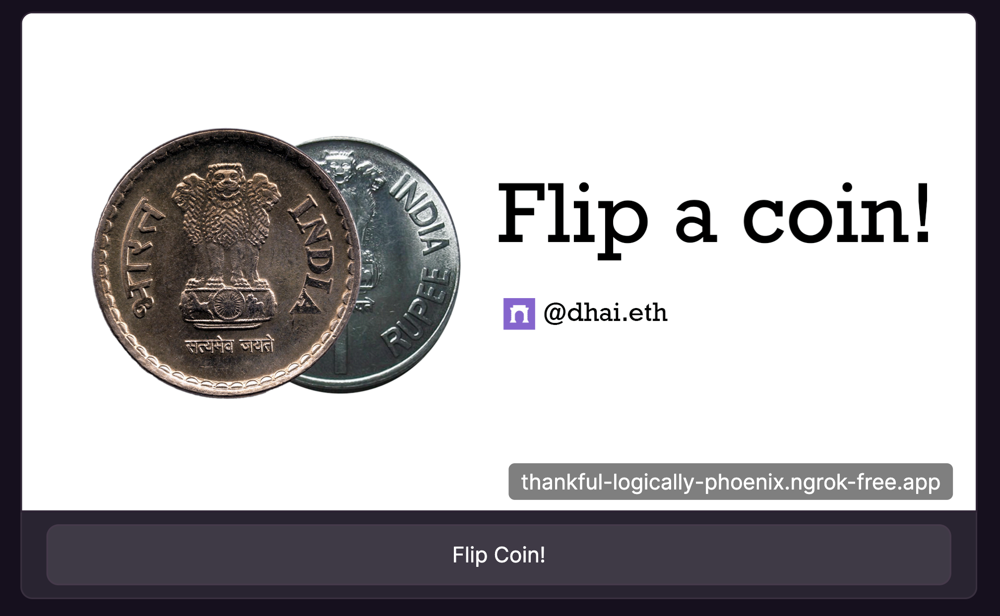
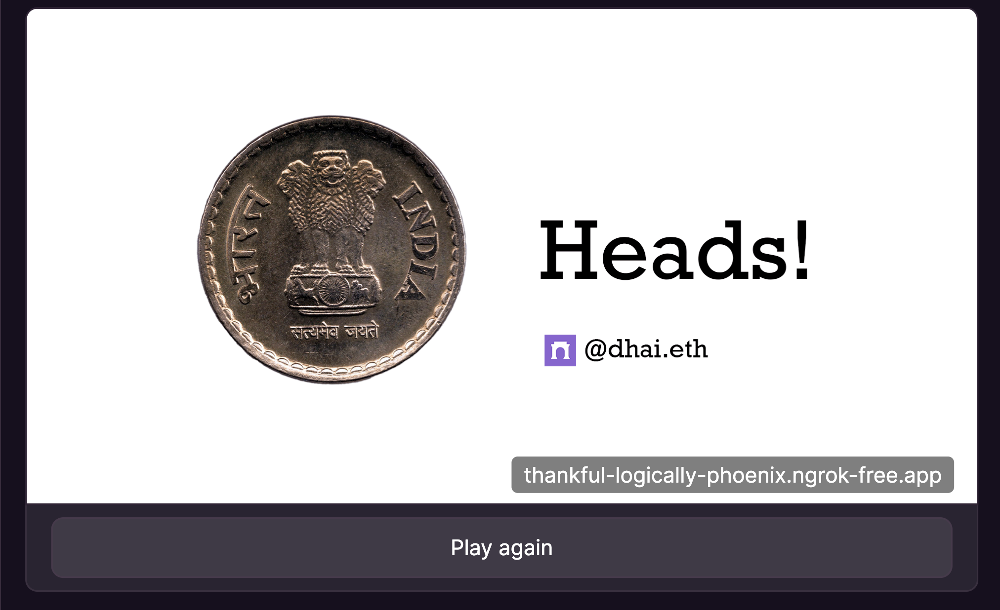

# Coin Flip Farcaster Frame

A Farcaster Frame that lets you flip a coin. Pretty simple.

## Deploying Your Own Copy

To deploy your own copy of this frame, deploy this app to the platform of your choice and configure the following environment variables:

- `NEXT_PUBLIC_BASE_URL`: Set this variable to your deployment URL _after_ deploying the app. For example, if you deploy to Vercel, set this to `https://your-app-name.vercel.app` after deploying.

- `NEYNAR_API_KEY`: You can set this to `NEYNAR_ONCHAIN_KIT` if you don't have a [Neynar](https://neynar.com/) API key. If you have one, use that of course.

That's it! You should be good to go.

Your frame URL will be `https://your-app-name.vercel.app/` or whatever platform you deploy to. Basically, it's the `/` route.

___ 

If you don't want to deploy your own, you can use my deployment at https://coin-flip-farcaster-frame.vercel.app/ as your frame URL and it should work just fine if you include it in your cast.